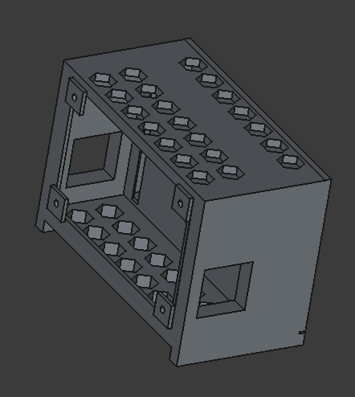

+++
date = '2025-08-05T23:58:38-07:00'
draft = false
title = 'Airquality Sensors...a Terminal Dawn Side Quest'
description = "Side Quest to work with a group of Air Quality Sensors."
summary = "For this...the hard part was the wiring not the design! I did it all in FreeCAD"
tags = ["software", "freecad", "cad", "terminal-dawn", "raspberry-pi", "3d-design", "air-quality", "sensors", "iot"]
categories = ["Hardware"]
keywords = ["raspberry-pi", "sensors", "freecad", "software", "air-quality", "co2", "sbs", "grafana", "influxdb", "environmental-monitoring"]
series = ["TerminalDawn"]
series_order = 3
showComments = true
showDate = true
showAuthor = true
showReadingTime = true
showEdit = false
showToc = true
heroStyle = "background"
+++

This week turned out vastly different than I had originally planned. I needed to make myself a Pi-powered air quality monitor. Again, how hard could something like this be? Actually...pretty easy! The hardest part I'll get into as we go down the path together. Yes it's still related to Terminal Dawn, but no it's not something specific about the project, but it will lead into a method for starting a module ecosystem. Just you know..as the design goes, not this version of it, this is standalone but the concepts will work.

## Air Quality

One of the unofficial seasons up where I live is smoke season. I'm often concerned about the air quality and hey I get curious if there's a drop in the air quality in my own home if my filter needs changed. I'll never know without monitoring right? So in typical me fashion, I dipped a toe in, lost my balance, and fell all the way into this rabbit hole. This might be a longer post than normal, but I hope it'll be worth it in the end.

I could go into math, but come on you all know my voice about nowish, or at least have a sense of it. So let's just say bad air in home without exchange = bad....that's why it's called "bad air". So I looked into it, and I'll fully blame the trip to GrafanaCon and the IOT sensor setup they had on the lab floor. Awesome stuff! I was inspired so I started looking at it. Probably just need a CO2 sensor right?

## Sensor Army

I'll put links in the bottom for products. However here's the list of things I got...include the CO2 sensor.

#### MH-Z19C

This little baddy is a CO2 sensor. It detects the gas concentration and commnicates over UART.  It's in theory fairly accurate, however since I don't have anything to test it against, we'll take it on faith. It looks science-y and therefore must be very science.

I've heard UART a bunch, and it wasn't until this project I looked at what it was. I always nodded sagely as I understood. UART stands for *Universal Asynchronous ReceiverTransmitter*. It's a dirt simple protocol and the digital equivalent of walkie talkies. Only one device can talk at a time. Connect TX (Transmit) of one device to RX (Receive). Simple, reliable and common with sensors.


#### SGP-40

In theory this little dude is a VOC (Volatile Organic Compounds) Gas sensor. It runs over I2C. It detects a range of things in 0-1000 ppm of ethanol and friends, and it meant to detect a host things like coal, natural gas, cigarette/cooking smoke and construction stuff. It's an overall quality thing vs specific gas emissions. I have a massive love hate with this thing. Love what it does, Hate that it took me 3 sensors before I got one that worked. Okay...Technically sensor #2 worked, it heated up and burned my finger. Althought considering this is an airquality monitoring station and not a pocket BBQ discussion...I exchanged it.

#### BME280

This does the temperature, humidity, barometric pressure readings. Standard, simple, and super tiny! Came in a pack of two.

#### PMS7003M

This one is the heavy lifter. This is a particulate sensor that measures stuff in the air. Measures particles down to 0.3μm with 50% accuracy, and 0.5μm with 98% accuracy. It even counts particles by size, 0.3, 0.5, 1.0, 2.5, 5.0 and 10μm per 0.1 liter of air. That's a lot of numbers, still with me? Good. This means dust, plaster, smoke, etc..

#### SGP-41

Same as the SGP-40 but it adds the ability to detect NOx (Nitrogen Oxides). I can tell if I'm huffing exhaust pipes in my office or not. It can also tell the difference between organic compands and combustion-related stuff, giving me two readings. Yes both sensors are in here.

## Next Step

Well first testing everything on the Pi GPIO pins. The SGP-40 took me three sensors to get a functional one. The rest all of them worked! A bit of breadboard work and I'm solid now. So now I have all the sensors being detected on the system either over */dev/ttyS0* or I2C. I have put several different scripts together, each one dedicated to each sensor....now what to do with the data....what to do indeed.

## The Software

I installed influxb on the pi, installed grafana, I have them configured to talk to each other. The scripts all speak influxdb and talk directly to the database. From there, Grafana will be pulling the data from influxdb and displaying the data on a set of dashboards. Why a set? EXCELLENT QUESTION! Because I put a 5" screen on the front of my enclosure and it's on a playlist showing each graph in real time...or near real time cause you know it rotates through all the displays and yadda yadda yadda.

## The Enclosure

I designed it entirely in FreeCAD. Amazing what the Terminal Dawn project has taught me. I did design it as one single piece however and I think it'll work wonders with everything. I stole the screen mount from Terminal Dawn and put it in a boxy case with a bunch of hexagonal vents all along. I have a Noctua 40mm fan going in that will run around 10% RPM speed to keep the sensors covered in fresh air without ruining their readings. The main chamber houses the fan, pi, screen. I put a small 5mm slot in the seperating wall with a chamfer to channel some part of the air into the chamber. That chamber has the hexagon holes allowing the positive airflow to escape. Since it's one single piece, I'll be leveraging OrcaSlicer's ability to slice a model on the table and add mounting options to it so I can print it all, not be all doofy with it and then assemble it all into one unit. Wires will also go through the 5mm slot.

Here's a wierd angle of the enclosure

Until next time! I'll tell you how it works and share some pictures of the dashboard. Again, this could easily turn into a set of individual or group plugin modules to expand Terminal Dawns capabilities!

## Parts List
 - [MH-Z19C](https://www.amazon.com/dp/B0CRKGP143)
 - [SGP-40](https://www.amazon.com/dp/B09FKFYMPR)
 - [SGP-41](https://www.amazon.com/dp/B0CDWYQYY6)
 - [BME280](https://www.amazon.com/dp/B0DHPCFJD6)
 - [PMS-7003](https://www.amazon.com/dp/B0B7RLR2NH)
 - [Noctua Fan](https://www.amazon.com/dp/B07DXS86G7)

## Software List
 - [OrcaSlicer](https://www.orcaslicer.com/)
 - [influxdb](https://www.influxdata.com/)
 - [Grafana](https://grafana.com/)
