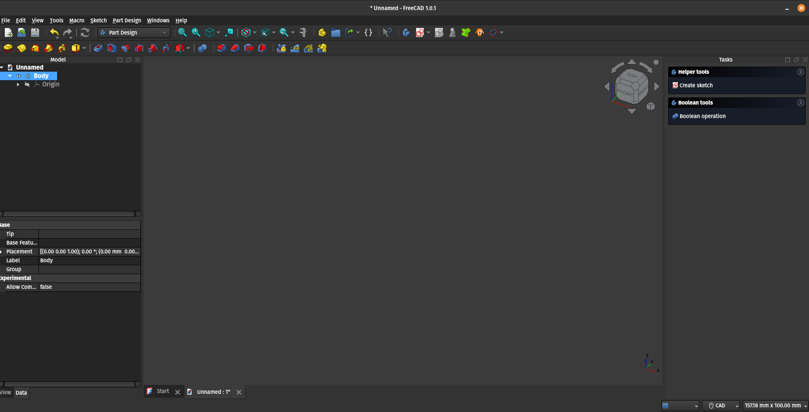
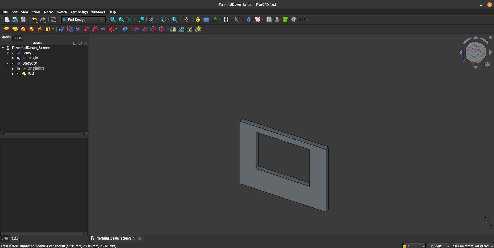

+++
title = 'Freecad Series Part 1'
date = '2025-07-13T19:01:53-07:00'
draft = false
description = "FreeCAD...it's CAD how hard could it be?"
summary = "Really, how hard could FreeCAD be? I can do this, I've made a Donut in Blender, I used to use 3DS Max..."
tags = ["software", "freecad", "cad", "terminal-dawn", "solar", "raspberry-pi", "3d-design"]
keywords = ["off-grid computing", "raspberry-pi", "solar", "freecad", "software"]
series = ["FreeCAD"]
series_order = 1
showComments = true
showDate = true
showAuthor = true
showReadingTime = true
showEdit = false
showToc = true
heroStyle = "background"
+++

Really...couldn't that hard right? I should be able to do this. I mean I made the original entirely in tinkercad...Speaking of I will be posting a full walk through of what V1 looks like, including measurements. So I set goal for myself dimension-wise. I am going to shrink this down to a small 216mm x 280mm, or roughly 0.5 mm larger than a standard piece of paper.

## Starting off

Armed with the confidence that there is no possible way this would be difficult. I downloaded FreeCAD, cracked my knuckles and opened it up. Clicking through all the basics of choosing the default theme (dark, of course). I was dropped into the interface, like jumping out of a plane and not being sure you have your parachute. Of course, I could absolutely watch some tutorials, which drives me insane, I would rather read my tutorials. However, what self-respecting engineer hits the tutorials first. We go all in head first!

Looking at the menu, I'm making a thing that's a bunch of different parts. So...knowing this is a parametric CAD program, it made sense to me to start with an assembly. After about 15 minutes of digging around in the application. I realized that an assembly is made up of parts. Parts I didn't already have. I needed the parts to *add* to an assembly. Start with a parametric part.

## Finding the right part of the software

Parametric parts. That's where you start. Once in this section of FreeCAD, you're dropped into this lovely interface. 

Now what? It was at this moment, I was frustrated. I mean I was frustrated before this, but I was frustrated now too (thank you Mitch Hedberg!). After spastically clicking around I ended up adding a new body via a context menu, and then was presented with a star shaped thing with combinations of different axes. Then it hit me, I've been thinking in 3 dimensions. This is CAD, in case you didn't know CAD is an acronym, computer-aided design. Its original intention was to make 2d drafts.

## Finally using the right tool

So first, you have to make a 2d sketch. That's why all the axes are displayed, you pick a pairing and draw a very accurate 2d shape. After that, you hop out of the sketch after you're satisfied and choose the "Pad" tool outside of the sketch tool. This for lack of a better term "extrudes" your 2d part and gives it depth. Boom, I now have a 3D Box with a hole in the middle. 

## Results

I have a very cool 3D Frame for the monitor. It's missing 99% of the features I need, but at least I can put a monitor in it (in theory). I have a hard reality check still making it's way through the pipes. Sure I'm going to make this  a parametric thing of amazingness. Then another and another and another until I make it into an assembly, where I will agonize over placement and redesign everything at least 3 times before I'm satisfied with it. 

Final verdict: I think the precision is going to be 100% worth the effort...but I have a lot of effort that needs to be poured into this.

## Next steps

After I get my feet under me and maybe a few more models, I plan on distilling this into a quick bootstrap tutorial about taking your thoughts from your brain into CAD and into whatever medium you want. I'll cover such provocative subjects such as "Deleting your sketch and how to not do that by accident" and "my cat walked on my keyboard and the parts disappeared. Next time, I plan on having my switch mounts, microSD storage sorted out and in CAD.
