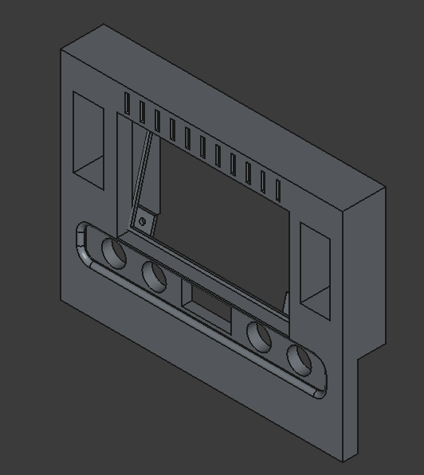
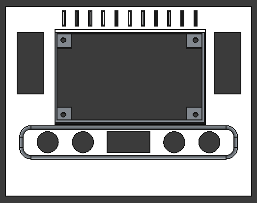
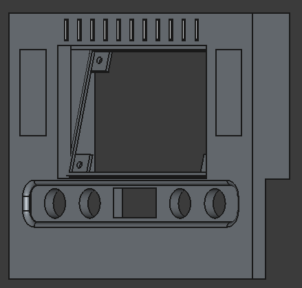
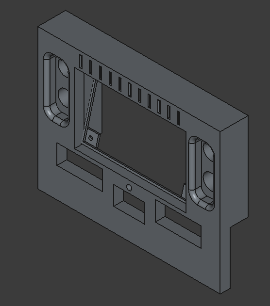
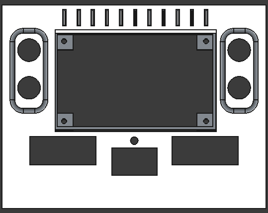

+++
title = 'Freecad Series Part 2'
date = '2025-07-20T23:01:24-07:00'
draft = false
description = "FreeCAD and I are in a complicated situationship"
summary = "It was harder than I thought but I feel like I've turned a corner, and every time I think that FreeCAD hits me with a twist..."
tags = ["software", "freecad", "cad", "terminal-dawn", "solar", "raspberry-pi", "3d-design"]
keywords = ["off-grid computing", "raspberry-pi", "solar", "freecad", "software"]
series = ["FreeCAD"]
series_order = 2
showDate = true
showAuthor = true
showReadingTime = true
showEdit = false
showToc = true
heroStyle = "background"
+++

So I've gone from "couldn't be that hard" to, I *can* do this. The front panel has hit something like 85% completion. Sure, arbitrary percentage considering I have no idea how much work is left and I have some absolutely crucial things to do. After all, pretty sure a full enclosure is more than just a face plate. Granted, it's pretty.

## First Brick Wall

I ran into the move/array transform tool. Ran into is a little too..formal, I tripped fell, spilled my coffee and landed in it face first. I created a MicroSD card slot specifically designed to store the thing. If anyone is curious it's a 15.5mm x 11.5mm x 1.5mm rectangle. We have established that I am not super amazing at math, and figuring out the spacing was about 15mm between the slots giving me a total of 11...I counted. Each slot has a 1mm fillet.

So why microSD slots? I'll do a deeper dive on this later in a specific article about Terminal Dawn. The TL;DR version is, storage density and shape variety. I'm trying to make this for easy to grab components from anywhere instead of pigeonholing everyone into a specific make/brand of USB stick, I can fit more gigabytes into a smaller space making the design easier.

### Whats the difference between a fillet and a chamfer?
Excellent question. **Fillet** is a rounded edge meant to strengthen an object and it gives a nice polished look and if you add enough of them, you fall into a timewarp and end up in the 1960's. A **Chamfer** is angled edge, think 1980's, everything angled. It serves the same purpose. Although a chamfer is mildly lighter on manufacturing therefore mildly cheaper.

Back on point. So once I had created one item (sans fillet at this point) I highlighted it and clicked the Move/Array tool. I dropped in the number of copies and picked the origin point..and started moving my mouse. Boom, the identical copies I wanted. I picked the spacing and FreeCAD made my computer do what computers do best. Math. *N* copies of *XYZ* size with *ABC* spacing = array of MicroSD slots. Pretty sure this is the actual python code that does this by the way, I'm just pushing the mouse.

Exited the sketch...clicked the Boolean Pocket method for subtracting material and chose my depth. I had a full array of microSD cards now. Done! I chose pocket because it felt right, and the dialog for a hole was way more information than I have and read like it was for a threaded hole instead of just a generic hole. I'm not there yet...maybe this week I'll dive into this?


**TL;DR:**
 1. Click Surface for sketch
 1. Create Sketch
 1. Select new Sketch
 1. Click Move/Array tool
 1. Set the number of copies
 1. Move Mouse/enter numbers in (warning, one will be the angle..which is weird)
 1. Click or hit enter.
 1. Done

## Second Brick Wall

Inside of the sketcher how do I combine geometries? I spent hours on this trying to figure out ways. Boolean operations are in the Modeler not Sketcher. It felt like it should be easy, after all in Tinkercad, it's just click "Hole" and then combine them. Ended up I was overthinking it. There's a tool in there called "Trim Edge" which is different than what I was expecting. This little tool, this amazing little tool has a tooltip that says "Trim edges with respect to the chosen line" which is engineer for "Let me find the overlapping lines and delete them for you"...so I did one by one.

In theory when you're done you should have a solid object. Wanna guess if I had a solid object or not? I didn't. So how do you handle that? Select the geometry and validate the geometry (which is in the menu). Go through the dialogs to validate and repair the geometry. You'll have one of two things. 1) A solid object (hopefully!) or 2) More questions that I am not prepared to help you with.

## Final Result

I made two things. One of them looks like a tape player, the other looks like this. Which one do you think is better?

Tape Original:

Newer Original:

Until next time, I'll be posting later this week about a bunch of decisions that were made for the design. I should have giscus up this week.
